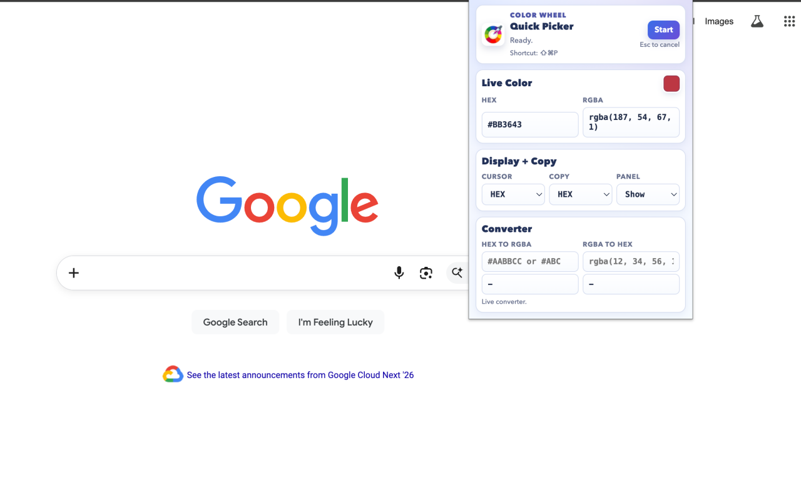
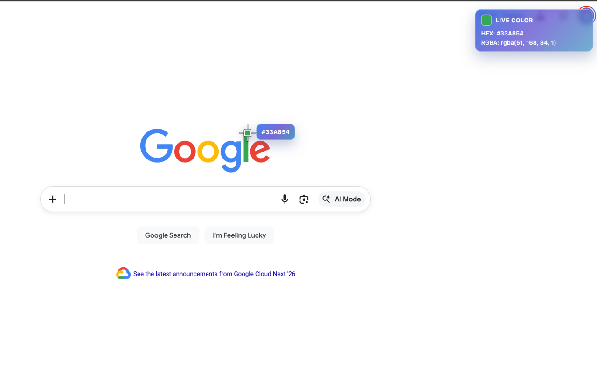

# Quick Color Picker

Quick Color Picker is a Chrome extension for sampling any visible color on a webpage and copying it instantly in HEX or RGBA.

## Why Use Quick Color Picker

- Click to copy color values instantly in HEX or RGBA
- Start the picker immediately with keyboard shortcut support
- Preview live color values while hovering
- End picking from popup controls or cancel with Esc
- Convert HEX to RGBA and RGBA to HEX directly in the popup

## Screenshots

## Keyboard Shortcuts

- macOS default: Command+Shift+P
- Windows/Linux default: Ctrl+Shift+P

Users can customize shortcuts at chrome://extensions/shortcuts.

## Installation (Unpacked)

1. Open chrome://extensions
2. Enable Developer mode
3. Click Load unpacked
4. Select this project folder

## Privacy Policy

Last updated: 2026-04-23

Quick Color Picker does not collect, sell, or share personal data.

### 1. Data Collection

- No personally identifiable information is collected.
- No browsing history tracking is performed.
- No user communication, financial, health, or authentication data is collected.

### 2. Local Storage

The extension stores only the following data locally using chrome.storage.local:
- Picker settings (format and panel preferences)
- Last picked color value

This data remains on the user device and is not transmitted to external servers.

### 3. Permissions and Purpose

- activeTab: run the picker on user-activated tabs
- scripting: inject packaged content script when picker starts
- tabs: check active tab availability and picker state UX
- storage: persist local settings and last picked color

These permissions are used only for color-picking functionality.

### 4. Network and External Code

- No remote JavaScript or WebAssembly is executed.
- No analytics or third-party trackers are used.
- No page content or picked data is sent to external services.

### 5. Clipboard Use

The selected color value is copied to clipboard only after explicit user action.

### 6. Changes to This Policy

This policy may be updated in future versions. Any updates will be reflected in this repository.

